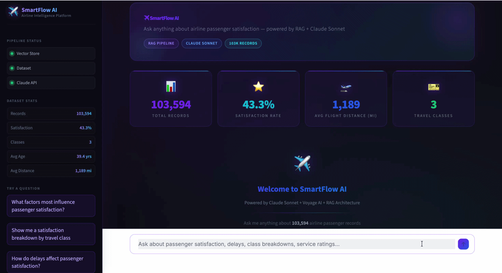

# ✈️ SmartFlow AI

**AI-powered airline passenger intelligence — ask anything, get data-driven answers instantly.**

SmartFlow AI is a production-grade RAG (Retrieval-Augmented Generation) chatbot that lets you query 103,594 airline passenger satisfaction records using plain English. Powered by Voyage AI semantic embeddings, a FAISS vector store, and Claude Sonnet, it delivers precise analytical insights alongside real-time Plotly visualizations — all wrapped in a professional dark glass UI.

---

## 🎬 Demo



> *Add a screen recording of the app in action and save it as `demo.gif` in the project root.*

---

## ✅ Features

- **Natural Language Querying** — Ask questions like "Which class has the highest satisfaction?" without writing a single line of SQL
- **RAG Architecture** — Voyage AI `voyage-3` embeddings + FAISS `IndexFlatL2` for semantic retrieval of the most relevant passenger records
- **Claude-Powered Analysis** — Claude Sonnet synthesizes retrieved context into precise, structured analytical responses
- **Auto-Generated Visualizations** — Keyword-triggered Plotly charts (pie, bar, box, histogram) rendered inline with every relevant answer
- **Conversation Memory** — Full multi-turn chat history maintained across the session
- **Pipeline Status Monitoring** — Live sidebar indicators for vector store, dataset, and API health
- **Professional Dark Glass UI** — Custom CSS with Inter font, purple/blue/cyan gradient palette, and animated pulse indicators
- **One-Click Sample Questions** — Five pre-loaded analytical prompts to explore the dataset immediately

---

## 🏗️ Architecture

```
┌─────────────────────────────────────────────────────────────────┐
│                        SmartFlow AI                             │
│                                                                 │
│   User Query                                                    │
│       │                                                         │
│       ▼                                                         │
│  ┌─────────────┐    Embed Query    ┌──────────────────┐        │
│  │  Streamlit  │ ───────────────▶  │   Voyage AI      │        │
│  │    UI       │                   │  voyage-3 model  │        │
│  └─────────────┘                   └────────┬─────────┘        │
│       ▲                                     │ Query Vector      │
│       │                                     ▼                   │
│       │                            ┌──────────────────┐        │
│       │                            │  FAISS Index     │        │
│       │                            │  (IndexFlatL2)   │        │
│       │                            │  103,594 vectors │        │
│       │                            └────────┬─────────┘        │
│       │                                     │ Top-K Records     │
│       │                                     ▼                   │
│       │                            ┌──────────────────┐        │
│       │      Analysis + Chart      │  Claude Sonnet   │        │
│       │ ◀────────────────────────  │  (Anthropic API) │        │
│       │                            └──────────────────┘        │
│       │                                                         │
│       └── Response + Plotly Chart rendered in UI               │
└─────────────────────────────────────────────────────────────────┘
```

**Data flow:**
1. User query is embedded by Voyage AI into a high-dimensional vector
2. FAISS performs L2 similarity search across 103,594 indexed passenger records
3. Top-5 most semantically relevant records are retrieved as context
4. Claude Sonnet receives the context + conversation history and generates a grounded response
5. If the query involves distributions or comparisons, a `SHOW_CHART` signal triggers an auto-matched Plotly visualization

---

## 🛠️ Tech Stack

| Component | Technology | Purpose |
|-----------|-----------|---------|
| **LLM** | Anthropic Claude Sonnet (`claude-sonnet-4-5`) | Intelligent response generation |
| **Embeddings** | Voyage AI (`voyage-3`) | Semantic vector representation |
| **Vector Store** | FAISS (`IndexFlatL2`) | High-speed similarity search |
| **Orchestration** | LangChain | Pipeline utilities |
| **UI Framework** | Streamlit 1.57+ | Web application interface |
| **Data Processing** | Pandas 3.x | Dataset ingestion and cleaning |
| **Visualizations** | Plotly 6.x | Interactive chart rendering |
| **Package Manager** | UV | Fast dependency resolution |
| **Language** | Python 3.12 | Runtime |

---

## 📁 Project Structure

```
smartflow-rag-chatbot/
├── app.py                   # Streamlit application — UI, chat loop, routing
├── main.py                  # Offline pipeline — builds the FAISS index
├── src/
│   ├── __init__.py
│   ├── rag_pipeline.py      # Voyage AI embeddings + FAISS index creation/retrieval
│   ├── llm_handler.py       # Claude API client + system prompt + error handling
│   └── visualizer.py        # Plotly chart functions + keyword-based query router
├── data/
│   ├── raw/
│   │   └── train.csv        # Source: Airline Passenger Satisfaction dataset
│   └── processed/
│       ├── bookings_clean.csv   # Cleaned tabular data for metrics
│       ├── faiss_index.bin      # Serialized FAISS vector index
│       └── documents.pkl        # Serialized document strings for retrieval
├── notebooks/               # Exploratory analysis notebooks
├── pyproject.toml           # UV project manifest + dependencies
├── requirements.txt         # Pip-compatible dependency list
├── uv.lock                  # Locked dependency graph
└── .env                     # API keys (never committed)
```

---

## 🚀 Getting Started

### Prerequisites

- Python 3.12+
- [UV](https://docs.astral.sh/uv/) package manager
- An [Anthropic API key](https://console.anthropic.com/)
- A [Voyage AI API key](https://www.voyageai.com/)

### Installation

**1. Clone the repository**

```bash
git clone https://github.com/nishant-2211/smartflow-rag-chatbot.git
cd smartflow-rag-chatbot
```

**2. Install dependencies with UV**

```bash
uv sync
```

Or with pip:

```bash
pip install -r requirements.txt
```

**3. Configure environment variables**

```bash
cp .env.example .env
```

Edit `.env` with your API keys (see [Environment Variables](#-environment-variables) below).

**4. Build the vector index**

> Skip this step if `data/processed/faiss_index.bin` already exists.

Place the raw dataset at `data/raw/train.csv`, then run:

```bash
uv run python main.py
```

This embeds all 103,594 records via Voyage AI and writes the FAISS index to `data/processed/`. The process takes ~15–20 minutes on first run due to API rate limiting.

**5. Launch the app**

```bash
uv run streamlit run app.py
```

Open `http://localhost:8501` in your browser.

---

## 💬 Usage Examples

Once the app is running, try these questions:

**Satisfaction analysis**
> *"What factors most influence whether a passenger is satisfied?"*

**Class comparison**
> *"Show me a satisfaction breakdown by travel class"*

→ Claude responds with a structured analysis, and a grouped bar chart appears automatically.

**Delay impact**
> *"How do departure and arrival delays affect passenger satisfaction?"*

→ Returns a box plot comparing delay distributions for satisfied vs. dissatisfied passengers.

**Demographics**
> *"What is the age distribution of satisfied passengers?"*

→ Overlapping histogram rendered immediately alongside the textual insight.

**Business vs. personal travel**
> *"Compare business travel vs personal travel satisfaction rates"*

→ Bar chart plus a numerical breakdown with key differences highlighted.

---

## 🔑 Environment Variables

Create a `.env` file in the project root with the following keys:

```env
# Anthropic Claude API
ANTHROPIC_API_KEY=sk-ant-your-key-here

# Voyage AI Embeddings
VOYAGE_API_KEY=pa-your-voyage-key-here
```

| Variable | Required | Description |
|----------|----------|-------------|
| `ANTHROPIC_API_KEY` | Yes | Authenticates Claude Sonnet API calls |
| `VOYAGE_API_KEY` | Yes | Authenticates Voyage AI embedding requests |

> **Never commit `.env` to version control.** It is already listed in `.gitignore`.

---

## ☁️ Deployment

### Streamlit Community Cloud

1. Push the repository to GitHub (ensure `data/processed/` artifacts are included or pre-built in CI)
2. Go to [share.streamlit.io](https://share.streamlit.io) and click **New app**
3. Select your repository, branch (`main`), and entry point (`app.py`)
4. Under **Advanced settings → Secrets**, add your environment variables:
   ```toml
   ANTHROPIC_API_KEY = "sk-ant-..."
   VOYAGE_API_KEY = "pa-..."
   ```
5. Click **Deploy** — the app will be live within a minute

> **Note:** The FAISS index (`faiss_index.bin`, ~400 MB) must be committed or pre-built as part of your deployment. For large files consider Git LFS or mounting a cloud storage volume.

---

## 🧠 What I Learned

- **RAG is a precision game** — chunk granularity and embedding model quality directly determine whether retrieved context is relevant or noise. Structuring each document as a richly annotated passenger record (rather than raw CSV rows) dramatically improved retrieval accuracy.

- **Semantic search ≠ keyword search** — Voyage AI's `voyage-3` model retrieves records based on *meaning*, not exact phrasing, enabling queries like "older frequent flyers" to surface the right cohort without hard-coded filters.

- **LLM output signals unlock UI logic** — Using a `SHOW_CHART` prefix as a structured signal from Claude (rather than a separate classifier) allowed the front-end to conditionally render visualizations without a second API call, keeping latency low.

- **Conversation memory context management** — Injecting the full `chat_history` into every Claude request maintains coherence across follow-up questions, but requires trimming to stay within token limits as conversations grow.

---

## 👤 Author

**Nishant**  
MCA Graduate | GenAI & Data Engineering Enthusiast

[](https://linkedin.com/in/nishant2211)
[](https://github.com/nishant-2211)

---

## 📄 License

This project is licensed under the [MIT License](LICENSE).

---

<p align="center">
  Built with Claude Sonnet · Voyage AI · FAISS · Streamlit
</p>
